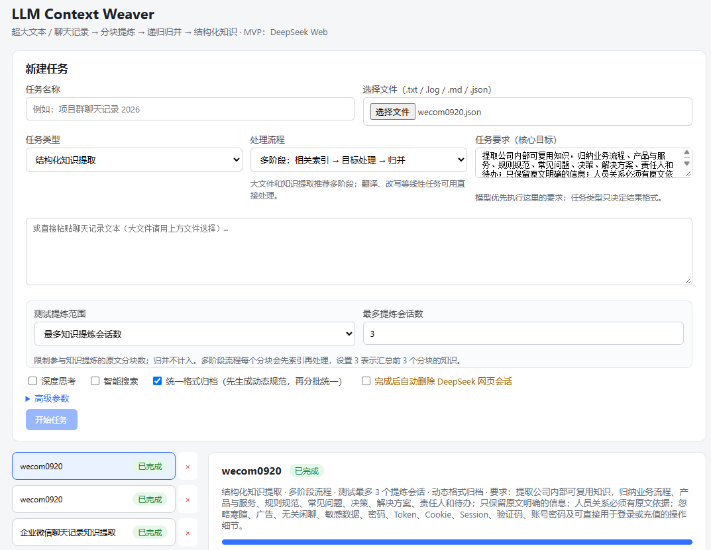

# LLM Context Weaver

面向超大文本与聊天记录的浏览器扩展：调用网页大模型分块处理内容，提炼结构化知识，统一格式并递归归并，最终导出可复用的数据或 AI Skill。



## 核心功能

- **多种输入方式**：支持选择 `.txt`、`.log`、`.md`、`.json` 文件，也可以直接粘贴聊天记录或文本。
- **按目标处理**：用户填写的任务要求是核心目标，可用于提取知识、整理流程、提炼决策、生成用户画像或执行其他自定义处理。
- **多阶段知识提炼**：先定位与目标相关的内容，再回到原文提炼，减少无关信息干扰。
- **动态格式归档**：根据实际提炼结果生成格式规范，再分批统一分类、主题、时间、详情和人员关联，避免不同分块格式不一致。
- **递归归并**：自动将多个分块结果逐层合并，保留明确事实、时间、必要详情和差异。
- **测试范围控制**：可按输入百分比，或设置单轮最多处理的提炼会话数，方便小范围验证任务配置。
- **高级参数**：可独立开启深度思考、智能搜索和统一格式归档；任务完成后也可选择清理 DeepSeek 网页历史会话。
- **可靠执行**：支持暂停、继续、失败重试、扩展重载后恢复、生成中自动对账，以及 DeepSeek“继续生成”的自动处理。
- **限流保护**：识别限流并延迟重试，每完成一定数量的网页会话后主动冷却，降低连续请求触发风控的概率。
- **多种导出格式**：支持导出 JSON、Markdown，以及供公司 AI 助手使用的 `SKILL.md`。
- **敏感信息处理**：最终结果过滤密码、Token、Cookie、Session、验证码、手机号等敏感值，不回显可直接用于登录或充值的操作细节。

## 处理流程

知识提炼任务通常按以下流程执行：

```text
输入文件或粘贴文本
  → 分块与目标相关索引
  → 回到原文提炼结构化知识
  → 生成动态格式规范
  → 分批统一格式
  → 多层递归归并
  → 导出 JSON / Markdown / SKILL.md
```

翻译、改写等线性任务可以选择直接处理，跳过索引和知识格式归档。

## 使用方式

1. 下载 [0.0.1 发布包](https://github.com/TorbenXiong/llm-context-weaver/releases/tag/0.0.1) 并解压。
2. 打开 Chromium 的扩展管理页，开启“开发者模式”。
3. 选择“加载已解压的扩展程序”，载入解压后的目录。
4. 打开 DeepSeek Web，在扩展页面创建任务并开始处理。

当前版本首个网页模型 Provider 为 DeepSeek Web，适合先用较小测试范围验证任务要求和输出格式，再处理完整文件。
