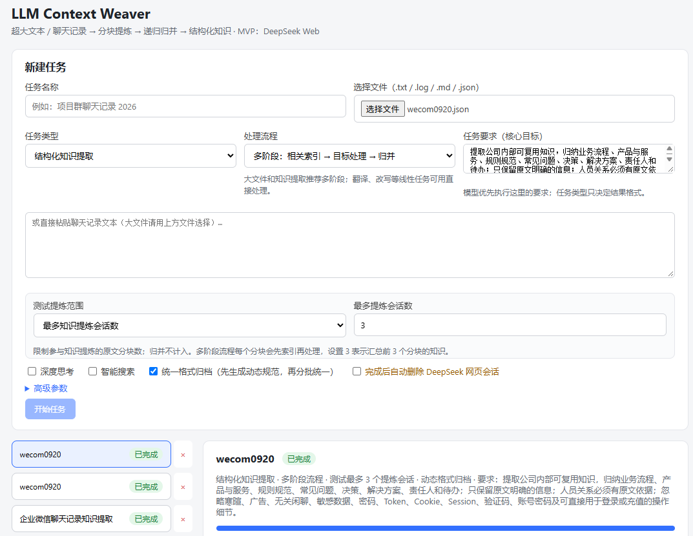

# LLM Context Weaver

处理超大文本与聊天记录的 Chromium 浏览器扩展：通过网页大模型分块提炼、统一格式和递归归并，导出 JSON、Markdown 或 AI Skill。当前支持 DeepSeek Web。



## 功能与流程

- 导入 `.txt`、`.log`、`.md`、`.json` 文件或粘贴文本，按任务目标提取知识、用户画像、决策等内容。
- 知识任务按需执行：前置格式规范 → 分块索引 → 原文提炼 → 后置格式规范 → 分批统一 → 递归归并。翻译、改写等文本任务走直接处理流程。
- 支持暂停、继续、失败重试、重载后恢复、按会话重跑，以及网页“继续生成”的自动处理。
- 按账号保存官方与主动限流；识别到新账号后，未处于冷却的账号可继续。本轮流量在换号后重置，累计流量保留。
- 遇到对话长度上限时，自动缩小原文分块或归并组，在新会话处理后继续归并。拆分保留全部原文及顺序，中间结果随状态持久化。
- 支持深度思考、智能搜索、网页历史会话清理和最终知识结果的敏感值过滤。

超限恢复有明确边界：完整 JSON 可直接收集；截断回复不作为完整结果保存。不可再分的单项、格式规范或过小分块走有限重试，归并无法收敛时保留中间结果并报告失败。程序不能保证网页模型提炼和归并时完全保留所有语义。

## 安装与升级

1. 下载[最新发布包](https://github.com/TorbenXiong/llm-context-weaver/releases/latest)并解压。
2. 在 Chromium 扩展管理页开启“开发者模式”，选择“加载已解压的扩展程序”。
3. 打开并登录 DeepSeek Web，在扩展工作台创建任务。

升级时先暂停任务，用新版本替换原扩展目录，在扩展管理页重新加载，再刷新模型网页并继续任务。保留原扩展及本地存储，不要通过卸载来升级。

账号来自页面账号入口；无法识别时显示“未识别”，不会用会话标题或正文猜测。两个账号若展示相同昵称或脱敏信息，目前无法可靠区分。网页结构变化可能需要更新 Adapter。

## 开发

技术栈：Manifest V3、TypeScript、React、IndexedDB。核心编排、分块、协议、归并与存储保持 Provider 无关；网页差异集中在 `src/providers/`。架构约束见 [AGENTS.md](AGENTS.md)。

已有依赖环境中的验证与构建命令：

```sh
npm test
npm run typecheck
npm run build
```

构建结果位于 `dist/`，可直接加载为扩展。首次依赖安装使用仓库的 npm 锁文件，需按本机规则确认。发布流程见 [docs/releasing.md](docs/releasing.md)。
